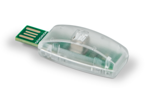
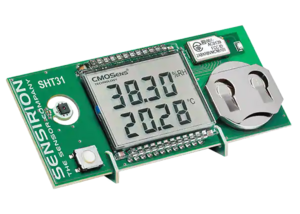

# Introduction

## About this document

This is a short introduction to the Sensirion MyAmbience app for iOS and Android devices. 
MyAmbience is used together with the official Sensirion Demonstrators which can be found on the [Sensirion website](https://sensirion.com/search?q=gadget) as well as 3rd party do-it-yourself demonstrators.

The Manual refers to myAmbience version 3.0 and newer. 

## Supported Demonstrators

Most of the following demonstrators are not publicly available for sale. We do however sell and hand out some demonstrators during our marketing events and at trade
fairs.
Visit us at our next trade fair near you. Go to [our website](sensirion.com/fairs-events) to check our upcoming events.

The following Demonstrators are currently supported:

### SCD4x CO2 Gadget

Learn more about the SCD4x and the SCD4x CO2 Gadget at [our website](https://sensirion.com/products/catalog/SCD4x-CO2-Gadget)

### SHT4x Smart Gadget

Learn more about the SHT4x and the SHT4x SmartGadget at [our website](https://sensirion.com/products/catalog/SHT4x-Smart-Gadget)

### SHT31 SmartGadget

This is deprecated but still compatible with the myAmbience app.
Learn more about the SHT3x and the SHT31 SmartGadget at [our website](https://sensirion.com/products/catalog/SHT31-Smart-Gadget)

### Nubo Air Monitoring system

Learn more about Nubo at [our website](https://sensirion-connected.com/solutions/nubo-sphere/)

### Do-it-yourself Demonstrators

You can create your own demonstrators and connect them to myAmbience!
Learn how to create your own on [our Github page](https://github.com/Sensirion/arduino-ble-gadget)!

# Getting Started

## Download myAmbience for your OS

### Apple iOS:
You can download the iOS MyAmbience app through the oficial Apple App Store through the following link or QR code:

[MyAmbience iOS App](https://apps.apple.com/us/app/sensirion-myambience/id1529131572#?platform=iphone) 

### Google Android:
You can download the Android MyAmbience app through the oficial Google Play Store through the following link or QR code:

[MyAmbience Android App](https://play.google.com/store/apps/details?id=com.sensirion.myam) 

## Requirements and Permissions

The following permissions need to be set so that myAmbience can detect surrounding demonstrators:

- Bluetooth on your device needs to be enabled and the app needs to have permissions for bluetooth
- On Android devices location permissions need to be given in addition. We do not store location information, however this is required by the bluetooth functionality since on some Android versions these are coupled
- The gadget needs to be in a range of 10-15 meters from the mobile. This ranges between devices, however, this is the typical operating distance of bluetooth devices.

# Using myAmbience

## Main Screens

MyAmbience is divided into three main screens:

- [Dashboard](#dashboard)
  
- [Plots](#plots)
  
- [Menu](#menu)
  

## Dashboard

### Gadget Overview

The main screen of myAmbience offers an overview of all the nearby active gadgets. Normally gadgets within a 10-15m radius can be found.

Each gadget has its own "card" which shows an overview of all the available sensor signals. The colors of the signals vary depending on the value and how "high or low" this is. An example is shown in the image below:

 

The gadgets are listed in an alphabetical order and the user can scroll down to see all of the available gadgets.

### Single Gadget Focus view
If you want to focus only on one gadget, you can tap on the card and a focused view emerges which shows the available values for each gadget and a set of statistics for the previous 24 hours such as minimum and maximum value as well as an average. An example of the focused view is shown in the image below:

 

### Favorite Gadgets

A new feature in myAmbience is the ability to "Favorite" gadgets. Favorite gadgets will always show on the top of the gadget list. 

To favorite a gadget, simply tap the heart icon on the bottom right of each gadget card as shown in the picture below:

 

The favorite settings are persistent even if your gadget is not in reach. The next time you are close to your gadget it will show up on top!

### Gadget Settings

You can configure certain aspects of your gadget! by tapping the cog wheel icon next to the favorites icon on the bottom right you go into the settings view. An example is shown below for the SCD4x CO2 Gadget:

 

Through the settings view you can:
- Update the firmware of your gadget. The app will automatically detect a firmware which needs to be updated and will let you know in the Settings View
- Change the name of your gadget. Please note, that this will change the gadget name only for your own device and not overall of the gadget
- See the battery percentage, the available logging memory and adjust the logging interval 
- (CO2 Gadget Only) Adjust the LED Brightness
- Turn on/off the LED by tapping on the light bulb on the bottom right

## Plots

The plot view is very useful to understand the historical data from your environment. For example how is the CO2 concentration when you sleep at night with closed doors and windows or what is the relative humidity in the summer versus the winter

### Gadget Selection

To see the plot for a gadget you can select it from the buttons in the bottom of the app. Selected gadgets show in Green.

Please note: By default a single tap on a gadget adds it in the list of the gadgets. If you would like to focus on the plot of only one gadget you have to long press the gadget button 

### Fetching old data

Currently, only the data captured while the app is active are shown on the plot area. However, most of the gadgets have internal memory which allows them to log the data and send it to myAmbience upon request.

To fetch the previously recorded data you need to press the download icon on the top right which will take you to the fetching view. 

The app needs to firstly connect to the gadget and then download the previously recorded data.

It is recommended that you are in close proximity of the gadget when trying to fetch the data.

In case the process fails or is interrupted you can start over again by following the same steps.

### Plot Interaction
The plot interaction is intuitive and simple to allow the users to focus on the signal values.

The x axis of the plots always show the time that the data was captured by the gadget. By using two finger gestures and pinching you can zoom in/out in the x axis while the y axis is automatically adjusted so that the whole signal(s) is in the view.

In case of multiple selected gadgets both plots are shown and the y axis is automatically adjusted so that it fits both plots.

By using the signal buttons above the plot area you can switch between the various signals and see their values.

#### Full Screen view

A new feature is the ability to go into full screen mode so that you can focus only on the plot at hand.

By tapping the arrow button just below the plot you enter the fullscreen mode as shown in the image below:

#### Time ranges and live mode

MyAmbience gives you the ability to quickly jump between different time ranges by tapping the relevant button below the plot area. This is particularly useful when you want to contrast data between multiple days or weeks to identify patterns in your indoor environment. 

A new mode in myAmbience is the live mode, this will automatically move the plot to always show the new values and it will retain the current time range. As soon as you manually move the plot, the app goes out of live mode and allows the user to see the previous measurements.

### Export and Share data

You can export the logged data from your gadgets through myAmbience.

The logged data are currently automatically exported in an EDF file format. The EDF format is CSV compatible which  means you can open it with Excel or any other csv handling capable editor.
The EDF files are compatible with ControlCenter and Dataviewer (Sensirion Evaluation Software), so that you can plot your gadget data in Dataviewer.

For more information about EDF files please visit the [ControlCenter Manual](https://sensirion.github.io/ControlCenterManual/#/?id=edf-files-explained).

## Menu

### App Settings

In the app settings you can adjust the general settings of myAmbience:

- Adjust the measurement system from measuring in degrees Celcius or degrees Fahrenheit or Kelvin
- Select which computed signals will be displayed if the measured signals are available
- Opt in/out in our analytics
- Connect to a Nubo device

### Manage Gadgets

The Manage gadgets area allows you to see all the previously detected gadgets and perform certain actions with their data. Actions include:

- Load the gadget as an offline device to visualize the data
- delete the gadget and its data
- delete the data of the gadget
- Select multiple gadgets

## Support and Feedback

A really important aspect of our mindset at Sensirion is to actively
solve problems of our users, therefore gathering feedback and supporting
our users is of outmost importance to us.

If you request any type of additional support please do not hesitate to
contact us by writing a quick note to
[support@sensirion.com](mailto:support@sensirion.com) with the topic 'MyAmbience Feedback'.

# Appendix
## Privacy Policy and information we collect

### Introduction

This privacy policy outlines details about the data processing in relation to the Sensirion Smart Gadget (“Device”) and the Sensirion MyAmbience mobile application thereto (“App”). In addition, we adhere to the general, Sensirion Privacy Notice, and you have all rights mentioned therein.

The Device allows tracking of environmental data, such as temperature, humidity and carbon dioxide. These data are saved locally onto the Device. The Device has a Bluetooth Low Energy (BLE) module which — when switched on — allows other Bluetooth enabled devices in the vicinity to connect to the Device and show current measured values as well as download saved data.

The Sensirion App allows the user to connect a mobile phone or tablet to the Device and show current measured values as well as download saved data.

The use of MyAmbience (by Sensirion AG) requires that we, Sensirion AG, collect, process, and store certain information about you and, as the case may be, your company. This includes information you provide to us, information we collect automatically, and information we receive from other sources. Such information may include personal data protected under data protection laws.

Please see the full Sensirion Privacy Notice located at https://sensirion.com/legal-notice/privacy-notice/ for the detailed Sensirion data privacy policy.

This Myambience Privacy Notice is in addition to the Sensirion Privacy Notice and highlights what we consider most relevant for you to know regarding the use of MyAmbience:

 

### The Information we collect

Information you provide to us, this includes
Information from actions you take. We collect information about your use of and activities on the services. This includes the type of sensors you connect, the measurement duration, and other related actions.
Other information you provide directly to us. You may have the option to submit additional information as you use MyAmbience. For example, you may participate in surveys where you can provide feedback on the product, which requires that you provide additional information about your device, yourself or your company.
Information we collect automatically, this includes
Information about your device. We collect information about the device you are using to access the services. This includes information like operating system information, screen size and browser information.
Information about your use of the apps or websites. We collect log and event information related to how and when you use our services (such as the sensors connected).
Information we receive from other sources, including third parties, and combine that information with the other information we have about you.
We use Mixpanel Analytics, an analytics service provided by Mixpanel Inc. (“Mixpanel”). For more information on how Mixpanel uses this data, please visit Terms of Use | Legal | Mixpanel.
In order to collect the above mentioned information, we rely on the default services provided by the Android and iOS operating systems.
 

### How we use your information

We use your information for the following purposes:

To provide customer service. We use your information to respond to your questions about our products and services, and to investigate bugs or other issues.
To report on our company’s performance. We use your information to track the fundamental metrics of our business, to perform financial reporting, to respond to regulatory obligations, and to debug billing issues.
To improve our services. We use your information to help us understand how users interact with our services, what features or products users may want, or to otherwise understand and improve our services. This includes information about how you use our services. As discussed in the ”How to control your privacy” section below, you can control whether your data is used for these purposes.
With your consent
We may also collect and use personal information with your consent. You can revoke your consent at any time (mostly through our services directly), though note that you might not be able to use services or features that require collection or use of that personal information.
 

### How to control your privacy

You can restrict our ability to use your data to improve our products. If you turn off the “Send Usage Statistics” setting under settings, we will stop collecting and using certain event and log information to help us understand how users use our services, what features or products they may want, or to otherwise improve our services.
You can request for your data to be deleted by sending an email to privacy@sensirion.com and by supplying your anonymous identifier found under the application settings
Please see the full Sensirion Privacy Notice located at https://sensirion.com/legal-notice/privacy-notice/ for an overview of the rights you have as a data subject.
 

### How we share your information

Aggregated or de-identified information. We may share information about you that has been aggregated or anonymized such that it cannot reasonably be used to identify you. For example, we may share aggregated user statistics in order to describe our business to partners or the public.
